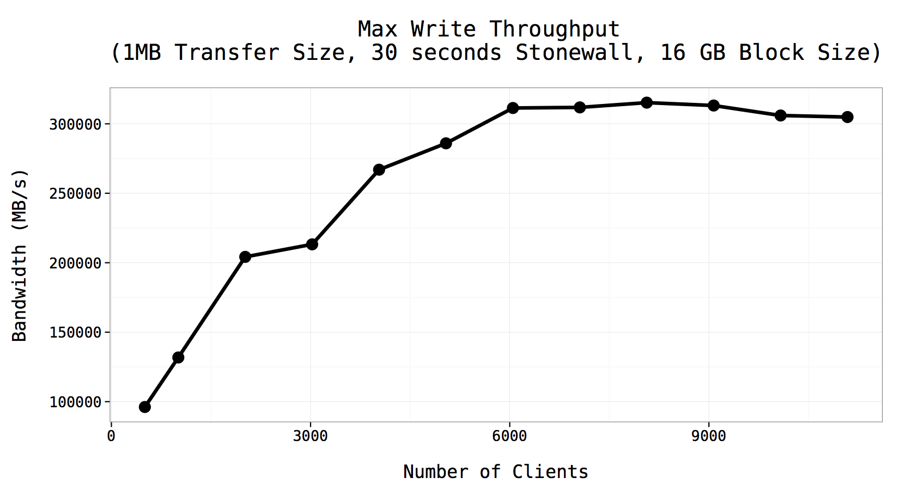

# Graphics with ggplot2

## Remove X-axis label

    g = g + theme(axis.title.x = element_blank())

## Change Y-axis label

    g = g + ylab("Y title")

## Fix (x,y) dimension size

    g = g + scale_x_continuous(breaks=seq(0,100,1), limits=c(0,100))
        + scale_y_continuous(breaks=seq(0,100,1), limits=c(0,100))

## Plot 3-variable dataset

Here we have 3 variables to play:  `clients`, `bw`, `stripe`. We want x axis
for client, y axis for bw, and stripe as a grouping variable.

    g = ggplot(data = df, aes( x=clients, y = bw, color=stripe, shape=stripe)) 
    g = g + geom_line(size=1.5, aes(group=stripe)) 

## Convert int to factor

Note that in above example, if `stripe` and `client` are integers, we need to
make it a factor first. We can check the type by:

    str(df)

And we can prep the dataset:

    df$clients = as.factor(df$clients)
    df$stripe = as.factor(df$stripe)

It probably also works by calling `factor(clients)` when you pass these
parameters to `aes` settings.

## Control axis scale

    g = g + scale_y_continuous(limits=c(0, 6), breaks=seq(0,6,1))

Note: breaks alone doesn't control the layout of scale.

## Examples

1. Plot single variables

[The source code](./fpp.R)

